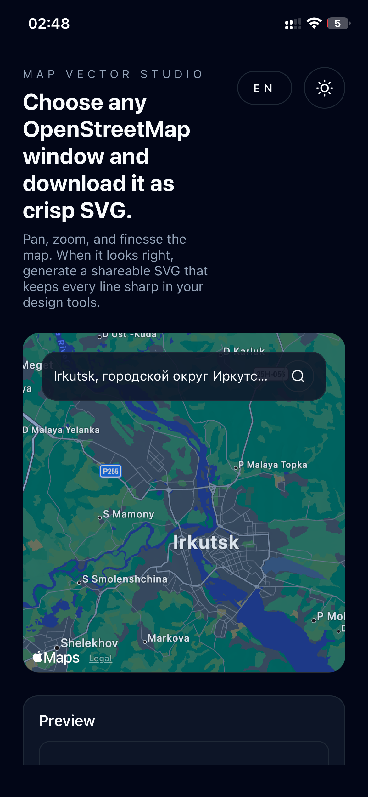

# Map Vector Studio




Map Vector Studio is an interactive map export tool built with Next.js. It lets you pan and zoom anywhere on OpenStreetMap, tune stroke weights, preview the result, and download a clean SVG that stays crisp in design tools and slide decks.
## Features
- Interactive Leaflet map with live bounds tracking and zoom-aware SVG sizing.
- Search powered by Nominatim so you can jump to cities, addresses, or landmarks.
- Client-side PNG preview generated from the returned SVG to validate the export before download.
- Adjustable outline thickness with sensible defaults that adapt to map zoom.
- Light/dark theme toggle plus English and Russian locale switching preserved in local storage.
- Exports that include roads, buildings, waterways, and other outlines fetched from the Overpass API.
## Tech Stack
- Next.js 15 (App Router, React 19, turbopack dev server).
- TypeScript with strict typing across components and API routes.
- Leaflet/react-leaflet for map rendering.
- Tailwind utility classes (via Next.js CSS) for styling.
- osmtogeojson to turn Overpass responses into GeoJSON, then custom SVG conversion in `src/lib/geojson-to-svg.ts`.
## Quick Start
### Requirements
- Node.js 18.18+ or 20+ (matches Next.js 15 support matrix).
- npm 9+ (or any package manager compatible with the provided lockfile).
### Installation
```bash
npm install
```
### Development server
```bash
npm run dev
```
Open `http://localhost:3000` to use the app. The Turbopack dev server supports hot reloading.
### Production build
```bash
npm run build
npm run start
```
## Using the App
1. **Pan and zoom** the map to frame the area to export. The bounds readout in the right column updates in real time.
2. **Search** for a place if needed. Typing a query triggers a Nominatim lookup; the best match recenters the map and adjusts zoom.
3. **Adjust outlines** with the slider to increase or decrease stroke thickness applied during SVG generation.
4. **Generate preview** to fetch fresh map data from Overpass, convert it to SVG, and render a PNG preview client-side.
5. **Download SVG** when the preview looks right. Downloads always use the untouched SVG returned by the API route.
Tip: keep the selected area reasonably small. Large bounding boxes may cause slow Overpass responses or 504 timeouts.
## External Services & Rate Limits
- **Nominatim** (openstreetmap.org) handles forward geocoding for searches.
- **Overpass API** (`overpass-api.de`) supplies OpenStreetMap vector data.
Both services are community resources with usage policies and rate limits. For production deployments, consider hosting your own Overpass instance, adding caching, and configuring a contact email in the user agent (see `src/app/api/*.ts`).
